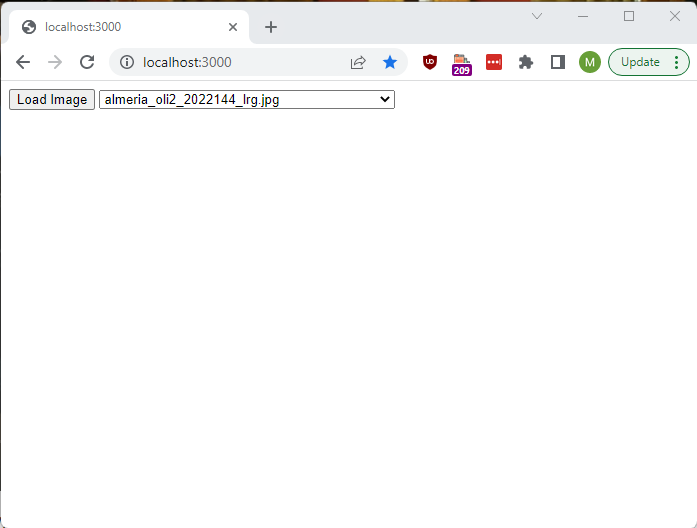

## Max Walker's Advanced Web Development Project
### What it Does

This is a HTML interface for OpenSeadragon, an open source viewer for images with large resolutions (>~3,000px x ~2,000px), running on node.js. format which allows users to zoom into high resolution images.

### How to run it

This code was developed on node 16.13.0, as such functionality is not guaranteed on earlier versions.

This code requires an active server to connect to. To start the server, navigate to the downloaded repository root folder `.../WebDev2/` and open it in your terminal shell of choice. Type `node .` 

Now connect to http://localhost:3000/ in your web browser of choice. 

You will need to press To add your own images, put them in WebDev2/images before starting the server. To apply changes, restart the server and the web page.

The viewer also works on the following filetypes: 
 - .DZI
 - .IIF
 - .OSM
 - .TMS
 - 