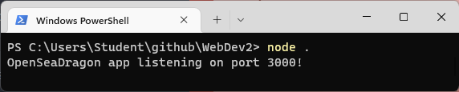
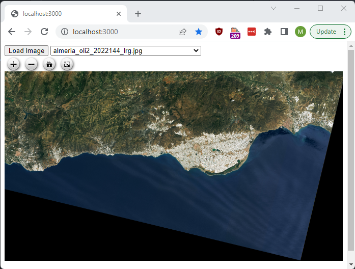
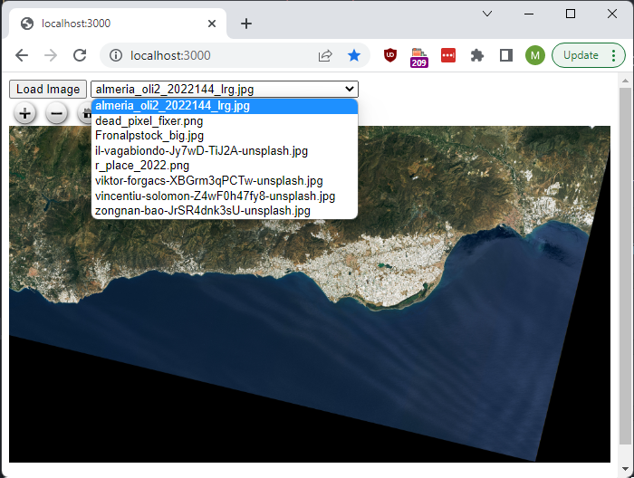
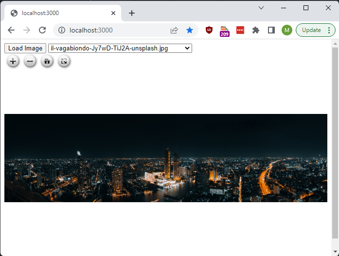
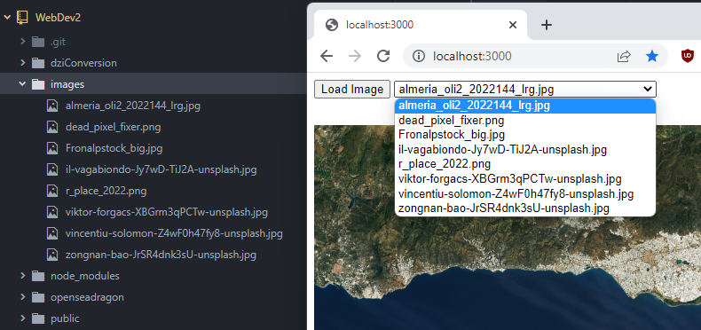

## Max Walker's Advanced Web Development Project
### What it Does

This is a HTML interface for OpenSeadragon, an open source viewer for images with large resolutions (>~3,000px x ~2,000px), running on node.js. format which allows users to zoom into high resolution images.

### How to run it

This code was developed on node 16.13.0, as such functionality is not guaranteed on earlier versions.

This code requires an active server to connect to. To start the server, navigate to the downloaded repository root folder `.../WebDev2/` and open it in your terminal shell of choice. Type `node .` 

Now connect to http://localhost:3000/ in your web browser of choice. 

The default image is a satellite photocollage of Almeria, Spain. 

To change the image you'd like to zoom into, select one from the dropdown text box.

To add your own images, you will need to put them in `./WebDev2/images` before starting the server. 

To apply changes, restart the server and the web page. You can also set the default image by changing the relevant URL variable in the `defaultImage()` function inside `client.js`.

The viewer works on the following filetypes: 
 - `.DZI`
 - `.IIIF`
 - `.OSM`
 - `.TMS`
 - All 'simple' image types, eg. `.png`, `.jpg`, `.gif`, etc.

### Future features
 - The images could be uploaded directly to the `/images` folder, saving the user having to open the viewer separately.
 - There is built in functionality for conversion to and from the native `.dzi` filetype for all the previously mentioned filetypes, this is in progress inside the folder `/dziConstruction`.

### Github Page
The development history for this product can be found at https://github.com/MaxWalker20/WebDev2